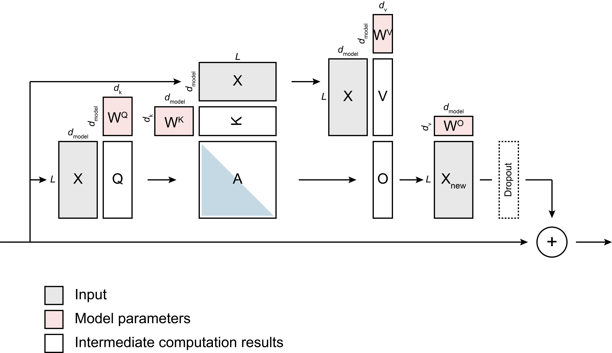

# Transformer

Transformer implemented from scratch in two ways:

| Variant | Description |
|---------|-------------|
| [numpy_based](./numpy_based/README.md) | Pure NumPy with manually derived gradients |
| [pytorch_based](./pytorch_based/README.md) | PyTorch primitives with autograd |

The NumPy variant implements everything from scratch — forward pass, backpropagation, and all gradient computations. Mathematical derivations for each component are linked from its [README](./numpy_based/README.md).

# The Transformer Architecture

I've had to read [the main Transformer paper](https://doi.org/10.48550/arXiv.1706.03762) many times in the past to fully understand it. And from time to time there seemed to be something that escaped my mind and I had to go back to it again. Each time I was a bit confused while reading the paper and I thought the paper could have been written better and more clearly. As conceptually simple as it seems (and it is simple really) the paper is pretty dense actually, and the figures are pretty bad in my view. I'm going to try and explain it here again, in a way that seems more straightforward and intuitive to myself. Hopefully, you you find it useful.

## Transformer architecture, better visualized

The figures in the Transformer paper are really confusing to me. I think just because they are technically "correct" it doesn't mean they communicate the ideas well. For example, there is no figure that puts together the entire attention mechanism end-to-end in a simplified way. Here's my attempt at doing so:



Here's the same schematic, rearranged, in case you find it easier to comprehend this way:

")

But if you're really used to neural networks being represented as multi-layer perceptrons, then the following might be the best representation for you. This simultaneously shows a) the whole attention mechanism end to end, b) the context-dependent nature of attention, which is reminiscient of meta-learning, and c) that the key `K` and value `V` have a special meaning in attention (hence, KV caching, why `K` and `V` can come from an encoder layer, why they might have different dimensionalities in multi-modal models, etc.).

")


## Attention as a generalization of a database

The core of the transformer is the attention mechanism (forget about the bells and whistels like "multi-head" and the "output" and the "dense layer" and "layer norm" etc etc; even the "in-projection" steps should be ignored for now). At the most basic level the transformer is powerful because it does a context-dependent computation (unlike, say, a [multi-layer perceptron](../mlp/)).

Below I'm comparing the attention mechanism to a Python dictionary. I use the terms "dictioanry" and "database" interchangeably.

In Python, we can do this:

```
db = {’a’: 1, ‘b’: 2}
query = 'a'
print(db[query]) # prints 1
query = 'c'
print(db[query]) # error: key not in dictionary
```

In essence, here's what's happening under the hood. `db` contains a set of `key:value` pairs. When we call `db[query]`, `query` is "compared against every `key` in `db`" (in quotes because this is not the algorithm that actually runs under the hood, but it _can_ be thought of in these terms). If `query` matches any key (`if exists`) then the `value` associated with the matching `key` is returned. Otherwise, this means that the `query` does not exists as a `key` in `db` and `error` is raised.

What we're *really* interested in in a database lookup is the *values* we get--the query and key are simply a means to that end. In the transformer attention mechanism, we are simply looking to extract a weighted average of all of our (context-dependent) values `V`.

The transformer attention generalizes this "hard" lookup with a "soft" lookup. The `query` is given as `Q`. The "dictionary" always contains some set of keys `K` (these may be useless, as in an untrained network, or useful, as in a well-trained network). When we `Q @ K.T` in the scaled dot product, we are doing the "compare against every key" step: the matrix multiply simultaneously performs a bunch of dot products. And what is a dot product geometrically? A *similarity metric*!

```
A = Q . K --> similarity: -1 if opposite directions, 0 if orthogonal, +1 if the same
```

Because this computation is done using real numbers and calculus, we are in the *continuous* regime (unlike the discrete/binary regime of the Python dictionary). Furthermore, the entries in `Q`, `K`, and `V` are high-dimensional vectors. This means the query `Q` is always "similar" (that's to say, a quantity can always be computed) to all of the keys in `K` (of which we have `L`), but the ***degree of similarity*** can be low or high. The application of the softmax function on top of this "lookup" operation is a convenience for making sure we get an appropriately weighted average (i.e., weights sum to 1) of the values `V`.

```
Q in R^{1 x D} # A single D-dimensional object
K in R^{L x D} # L entries in the dictionary (each D-dimensions)

Q @ K^T --> A in R^{1 x L} # similarity of the query to each and every entry in the database
```

The dictionary lookup reduces to the attention mechanism if in the attention algorithm we used binary values. For example, let's say we have compared our `query` in `Q` to all of the `key`'s in `K` and observed that it is the same as the fourth element. We have this information in `A` below:
```
A = [0, 0, 0, 1, 0], V in R^{5 x D_v}
O = A @ V in R^{1 x D_v}
```

In the second row above, note that a weighted sum when `A` is a one-hot encoded vector is the same as just selecting the ith vector in `V`! So we have done the same as:

```
db = {
    1: d_dimensional_vector_1,
    2: d_dimensional_vector_2,
    3: d_dimensional_vector_3,
    4: d_dimensional_vector_4,
    5: d_dimensional_vector_5,
}
O = db[4] # returns `d_dimensional_vector_4`
```